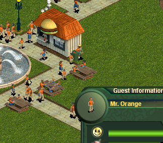
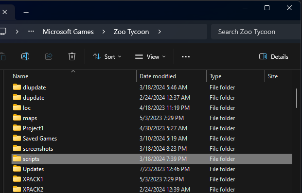
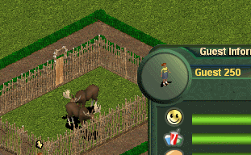

# Making an Easter Egg Mod

!!! warning "Difficulty: Advanced"

Easter eggs in Zoo Tycoon 1 were a fun way to add a little bit of humor to the game, or even to cheat your way to a better zoo. To activate an easter egg, you would click on a guest, staff member, animal, or exhibit and then change their name to a specific string. This would trigger the easter egg and give you a special effect.



## Tools Required

- Text Editor
- EMU API

We will need EMU API to create our easter egg, a tool that gives us scripting capabilities for Zoo Tycoon 1. You can download the latest version on its [GitHub page](https://github.com/openztcc/EMU). Make sure to follow the installation instructions on the GitHub page before continuing.

We will also need a text editor to write our script. Any text editor will do, but I recommend using [Visual Studio Code](https://code.visualstudio.com/). Check out the [Using Visual Studio Code](../tool-guides/visual-studio-code.md) guide for more information.

If you're new to scripting, Lua, or programming in general, I recommend reading the [Scripting in Zoo Tycoon 1](./lua-scripting-in-zt1.md) guide before continuing.

## Creating Our Script

EMU API reads Lua scripts from a directory called `scripts` in the game's main install directory located at `C:\Program Files (x86)\Microsoft Games\Zoo Tycoon`. If you don't have a `scripts` directory, you will want to create one for this to work.



Inside of the `scripts` directory, create a new file called `easteregg.emu`. This is the Lua file that will contain our easter egg script. Open this file in your text editor.

## The Easter Egg Template Script

```lua
function emu_run()
    -- Get the selected entity
    entity = general.getSelectedEntity()

    -- Only run if entity is selected.
    if not general.IsEntityNull(entity) then

        -- Create the ZTGuest object
        guest = ZTGuest.new(entity)

        -- Set all entities to invisible if guest name
        if guest:GetSelectedGuestName() == "<GUEST-NAME>" then
            -- <DO SOMETHING>
        end
    end
end
```

You will only need to modify the `<GUEST-NAME>` and `<DO SOMETHING>` placeholders to create your easter egg. The `<GUEST-NAME>` placeholder should be replaced with the name of the guest that will trigger the easter egg, and the `<DO SOMETHING>` placeholder should be replaced with the action you want to perform.

For this tutorial, I'm going to use the Invisible Fences Easter Egg as an example. Please make sure to uninstall the Invisible Fences Easter Egg script if you already have it installed before continuing because we will be recreating it, and you'll want to know if your work isn't in conflict with the existing script.

First, let's walk through what the template script is doing:

1. The `emu_run` function is called by EMU API when the game is running. Anything inside will run in sync with the game loop. (that means it will run every frame)
   
2. We get the selected entity from the game. An entity is anything in the game that can be placed from the purchase menu, such as animals, guests, staff, buildings, foliage, and scenery.

    ```lua
    entity = general.getSelectedEntity()
    ```

    The `GetSelectedEntity` function belongs to the `general` object, which is a global object that EMU API provides for us to interact with the game and is required. The `GetSelectedEntity` function returns the entity that is currently selected in the game, or `Null` if nothing is selected. We then store this result in a variable called `entity`.

3. The next line checks if the entity is not `Null`. If it is `Null`, then we don't want to run the rest of the script because there is nothing selected in the game.

    ```lua
    if not general.IsEntityNull(entity) then
    ```

    Like the `GetSelectedEntity` function, the `IsEntityNull` function also belongs to the `general` object. It returns `true` if the entity is `Null`, and `false` if it is not.

4. We then create a `ZTGuest` object from the `entity` variable. This is a custom object that EMU API provides for us to interact with guests in the game. We then store this result in a variable called `guest`.

    ```lua
    guest = ZTGuest.new(entity)
    ```

    Once we have a guest object, we can start operating on it with functions that EMU API provides. For example, we can now get the guest's name.
  

5. The next line checks if the selected guest's name is equal to the string `"<GUEST-NAME>"` using the `GetSelectedGuestName` function. Note that `GetSelectedGuestName` belongs to the `ZTGuest` object, and since we have a `ZTGuest` object stored in the `guest` variable, we can call this function on it.

    The syntax for calling a function on an object is `object:function()`. The `:` is used to call a function on an object, and the `.` is used to access a property of an object. This is a common pattern in Lua.

    ```lua
    if guest:GetSelectedGuestName() == "<GUEST-NAME>" then
        -- rest of code
    end
    ```

    If the condition is `true`, then we run the code inside of the `if` block. If the condition is `false`, then we skip the code inside of the `if` block.

## Customizing the Easter Egg Template Script

Now that we understand the template script, let's customize it for our Invisible Fences Easter Egg. We want to make all of the fences in the zoo invisible when a guest with the name "Mrs. Invis" is selected.

We will need the following functions:

- `ZTWorldMgr.GetAllEntitiesOfType(table)` - This function returns a table of all entities currently on the map. To find them, it takes in a table of integers that represent the entity type IDs. If you remember from other tutorials, IDs in Zoo Tycoon 1 are used to tie entities to the strings they display in the game, but also to the game's internal logic so that it can find those entities.

    For example, the game recognizes the ID number for the stick pole fence as `9313`, so when we feed this number into the function, it will return all of the stick pole fences on the map.

- `ZTFenceType.SetVanishGuard(bool)` - This function sets the visibility of the fence and also makes it indestructible. If we set the argument to `true`, the fence will be invisible and indestructible. If we set the argument to `false`, the fence will be visible and destructible.

    This function belongs to the `ZTFenceType` object, which is an object that EMU API provides for us to interact with fences in the game.

### Implementing the Changes
    
```lua 
function emu_run()
--  Add additional ids here if needed. Last id must be 0.
cNames = {9313, 9314}

-- Get the selected entity
entity = general.getSelectedEntity()

-- Only run if entity is selected.
if not general.IsEntityNull(entity) then

    -- Create the ZTGuest object
    guest = ZTGuest.new(entity)

    -- Set all entities to invisible if guest name
    if guest:GetSelectedGuestName() == "Mrs. Invis" then
        entities = ZTWorldMgr.GetAllEntitiesOfType(cNames)
        ZTWorldMgr.MakeInvisible(entities, false)

    -- Set all entities to visible if guest name
    elseif guest:GetSelectedGuestName() == "Mr. Show" then
        entities = ZTWorldMgr.GetAllEntitiesOfType(cNames)
        ZTWorldMgr.MakeInvisible(entities, true)
        end
    end
end
``` 

The `emu_run` function now has a new line at the top that creates a table called `cNames` that contains the IDs of the stick pole fence and the stick pole fence gate. We need to do this because the `GetAllEntitiesOfType` function requires a table of IDs to find the entities we want to operate on. If we really wanted to, we could add more IDs to this table to make more fences invisible, but for now we only need these two.

The `emu_run` function now has two new `if` blocks that check if the selected guest's name is equal to the string `"Mrs. Invis"` or `"Mr. Show"`. If the condition is `true`, then we run the code inside of the `if` block. If the condition is `false`, then we skip the code inside of the `if` block.

If the selected guest's name is equal to `"Mrs. Invis"`, then we get all of the stick pole fences and stick pole fence gates on the map and make them invisible. If the selected guest's name is equal to `"Mr. Show"`, then we get all of the stick pole fences and stick pole fence gates on the map and make them visible.

## Installing the Easter Egg Script

Once you have finished customizing the script, save it and remember that it needs to be in the `scripts` directory in the game's main install directory located at `C:\Program Files (x86)\Microsoft Games\Zoo Tycoon`.

Boot up the game and select a guest. Change their name to "Mrs. Invis" and you should see all of the stick pole fences and stick pole fence gates in the zoo disappear. Change the guest's name to "Mr. Show" and you should see all of the stick pole fences and stick pole fence gates reappear.



## Possible Errors

Since this tutorial is very specific to one possible application of this template script, there are many things that can wrong. Issues can be due to the game, the EMU API, or incorrect Lua syntax or EMU API function usage. If you need help diagnosing an issue, feel free to ask for help in the [OpenZT Discord server](https://discord.gg/KcpedmghWm).