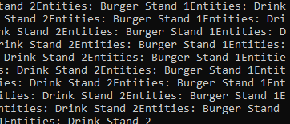

# Operating on Entities

!!! warning "Difficulty: Advanced"

This tutorial will cover how to operate on entities and entity types with [EMU API](../reference/emu/index.md) and Lua scripting.

First, let's get some lingo out of the way. Entities are what the game calls anything that can be bought and placed on the map. This includes animals, guests, staff, and scenery. In the context of the low level game machinations, there are two concepts to understand here: **entities** and **entity types**. An entity is an instance of an entity type. For example, **an African Elephant is an entity type**, and **an "African Elephant 1" that you place in your zoo is an entity**. 

Each entity type has a unique ID that the game both uses to identify it but also to tie it to a string in [one of the game's many string tables](../reference/string-tables/index.md). On the other hand, each entity has a unique codename ideally assigned to it through the game configuration files. The African Elephant's codename, for example, is simply `elephant`.

As of the writing of this tutorial, EMU API supports operating on *entity types*, but only supports *entities* in a limited capacity. This guide will cover both, but will focus on operations on the former.

## Obtain an Entity Type

When I say "obtain an entity type", I mean to get a reference to the entity type in the game's memory. The EMU API provides several utility functions that allow you to do this and all of them are available across two APIs: [World Manager](../reference/emu/api/worldmanager.md) and [UI General](../reference/emu/api/uigeneral.md). 

The World Manager API is used to obtain entity types from the game's world state, and the UI General API is used to obtain entity types as a result of the user clicking on them on the map.

This is essentially the same information you can find in the reference documentation, but I'll provide a brief overview here.

### World Manager API

| Command  | Description |
| ------------- | ------------- |
| `getAllEntitiesOfType(table entity_ids)` | Returns a table of all entities of the specified type IDs. For a list of entity IDs, see [List of Notable Entity IDs](../reference/string-tables/entity-ids.md). |
| `getEntityTypeByID(int entity_id)` | Returns an instance of the specified entity type. |

### UI General API

| Command  | Description |
| ------------- | ------------- |
| `getSelectedEntity()` | Returns an instance of the selected entity. |
| `getSelectedEntityType()` | Returns an instance of the selected entity type. |

As you can see, we have a few tools we can use to obtain entities and entity types. If you want to use any of the functions detailed inside of the [Entity API documentation](../reference/emu/api/entities.md), you'll need to obtain an entity using either `getSelectedEntity` or `getAllEntitiesOfType` and then pass it to a `BFEntity` object or one of its subclasses.

This is an awful example, but it should give you an idea of how to use these functions.

Example:

```lua
function emu_run ()
    local ids = {8021, 8022} -- ids for Drink Stand, Burger Stand
    local entities = ztWorldMgr.getAllEntitiesOfType(ids)
    local building1 = BFEntity.new(entities[1])
    local building2 = BFEntity.new(entities[2])
    emuConsole.print("Entities: " .. building1:name())
    emuConsole.print("Entities: " .. building2:name())
end
```

In my test zoo I have a Drink Stand and a Burger Stand, so when I run this script, I get the names of both entities printed to the console on an infinite loop because this runs during the unpaused game loop.



## Operating on Entity Types

It's the same idea with entity types. If you want to use any of the functions detailed inside of the [Entity Type API documentation](../reference/emu/api/entitytypes.md), you'll need to obtain an entity type using either `getEntityTypeByID` or `getSelectedEntityType`.

Example:

```lua
function emu_run()
    local selected_entitytype = ztUIGeneral.getSelectedEntityType()
    if ztWorldMgr.isEntityNull(selected_entitytype) then
        return
    end
    local buildingtype = ZTBuildingType.new(selected_entity)
    io.write("Selected building purchase cost: " .. buildingtype:cPurchaseCost())
end
```

This time, I'm using the UI General API to get the selected entity type and then I'm using the `ZTBuildingType` class to get the purchase cost of the selected building. It's always a good idea to have at least a base case where if either of these functions return null, you return early so that the script doesn't need to run any further and potentially create undefined behavior.

This is a hypothetical example, but it should give you an idea of how to use these functions.