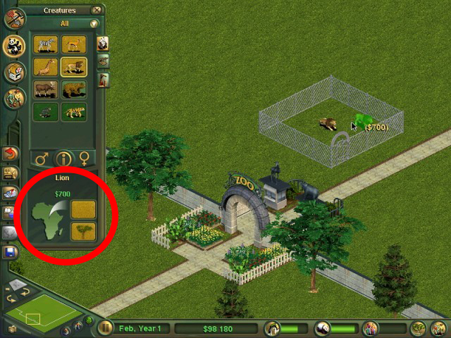

# Habitats and Locations

Habitats and locations appear in the animal buy window below the animal name as show in the picture below.



Zoo Tycoon comes with many inbuilt habitats and locations which can be referenced when making an animal, but prior to OpenZT modded locations or habitats were particularly hard to make. With OpenZT habitats and locations can be made and used with ease. They have a very similar config (in Vanilla ZT they are actually interchangeable, minus the UI looking wrong)

```toml
[locations.moon]
name="Moon"
icon_path="resources/moon/N"
icon_palette_path="resources/moon/moon.pal"

[habitats.swamp]
name="Swamp"
icon_path="resources/swamp/N"
icon_palette_path="resources/swamp/swamp.pal"
```

All values are mandatory here. The type is dictated by having the `locations` or `habitats` prefix in the section header. The suffix in the section headers (`moon` and `swamp` in this example) must be unique for each definition type within your mod, eg you can only have one `locations.moon` but you can have a `habitats.moon` too. You could have another `habitats.moon` in a separate mod, these will not conflict.

### Identifier vs Display Name

**Important:** The section header suffix is the **identifier** used in variable substitution, while `name` is the **display name** shown to players:

```toml
[habitats.swamp_habitat]  # ← "swamp_habitat" is the identifier
name = "Swamp Habitat"    # ← "Swamp Habitat" is the display name

# In a [patches.swap_gazelle] section - Use the identifier!
value = "{habitat.swamp_habitat}"  # ✓ Correct
value = "{habitat.Swamp Habitat}"  # ✗ Wrong - will fail
```

- **Identifier** (section suffix): Used in code, patches, and variable substitution. Must be unique within your mod.
- **Display name** (`name` field): Shown to players as a tooltip when hovering over the icon.

`name` is displayed as a tooltip when the player hovers over the habitat/location image in game.

`icon_path` is the path (within the resources) filepath to the icon file (in the ZT animation format) is located.

`icon_palette_path` is the path to the palette (`.pal`) file for the icon. 
!!! info 
    Vanilla ZT uses the `.pal` file referenced within the animation file, OpenZT ignores it and uses the file specified here.

## Adding habitats or locations to existing animals

You can add your custom habitats and locations to existing animals (from the base game or other mods) using OpenZT's [patch system](patch_mods.md).

### Quick Example

To add your swamp habitat to an existing animal like the crocodile:

```toml
# In your mod's patch.toml file
[patches.add_swamp_to_crocodile]
operation = "append_value"
target = "animals/crocodile.ai"
section = "Habitat"
key = "cHabitat"
value = "{habitat.swamp}"
```

The `{habitat.swamp}` variable automatically resolves to the correct habitat ID from your mod's habitat definition. You can similarly add locations:

```toml
[patches.add_swamp_location_to_crocodile]
operation = "append_value"
target = "animals/crocodile.ai"
section = "Location"
key = "cLocation"
value = "{location.swamp}"
```

### Adding to Multiple Animals

You can add your habitat/location to multiple animals by creating multiple patches:

```toml
# Add swamp habitat to crocodile
[patches.crocodile_swamp]
operation = "append_value"
target = "animals/crocodile.ai"
section = "Habitat"
key = "cHabitat"
value = "{habitat.swamp}"

# Add swamp habitat to hippo
[patches.hippo_swamp]
operation = "append_value"
target = "animals/hippo.ai"
section = "Habitat"
key = "cHabitat"
value = "{habitat.swamp}"

# Add swamp habitat to alligator
[patches.alligator_swamp]
operation = "append_value"
target = "animals/alligator.ai"
section = "Habitat"
key = "cHabitat"
value = "{habitat.swamp}"
```

### Cross-Mod References

You can even reference habitats and locations from other mods:

```toml
[patches.use_other_mods_habitat]
operation = "append_value"
target = "animals/elephant.ai"
section = "Habitat"
key = "cHabitat"
value = "{lunar.habitat.crater}"  # References the "lunar" mod's "crater" habitat
```

!!! note
    For cross-mod references to work, the referenced mod must be loaded before your mod (earlier in the zoo.ini mod list).

For complete details on the patch system including conditional patching, error handling, and all available operations, see the **[Patch Mods Guide](patch_mods.md)**.
