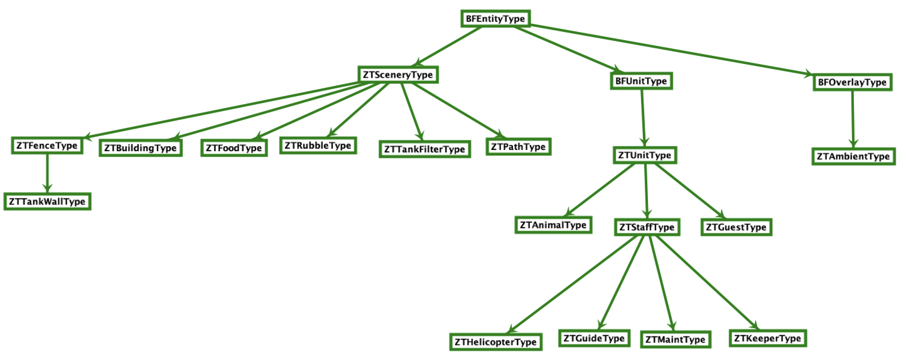

# Entity Types API

## Description of Entity Types

The game has generalized descriptions of entities which it calls "entity types". You can think of them as blueprints for the game's major objects, such as animals, guests, staff, and scenery. Generally speaking, any functions that operate on an entity function can be mapped to the configuration most Zoo Tycoon 1 modders are familiar with. When we change `cSelectable` to `1`, we are changing the `cSelectable` property of the entity type.

Note however that entity types are built on several levels of inheritance, and the entity type's behabior is determined by the properties of its parent entity types. For example, all functions available to the core entity type `BFEntityType` are also available to all of its children objects and their children, but not the other way around. This means that if you want to operate on a specific entity type, you need to make sure that the function you are calling is available to that entity type or else it will not work and may cause undefined behavior.

To make sense of this reference section, please refer to the following graph of inheritence as you read through the documentation:

<figure markdown="span">

<figcaption>Credit: Finn from the OpenZT project</figcaption>
</figure>

## Example Usage

This API relies on the programmer to obtain an entity type object from the game's memory in order to make use of any of the following functions. Here's an example of how you might obtain an entity type and change one of its properties:

Example Lua Script:  
*hideelephants.emu*

```lua
function emu_run()
    local elephant = GetEntityType("elephant")
    elephant:visible(false) -- hides all elephants
end
```

## BFEntityType

| Function Signature | Description |
| ------------- | ------------- |
| `int ncolors()` | Returns the number of colors in a `pal` file. |
| `int ncolors(int input)` | Sets the number of colors in a `pal` file. |
| `bool cIconZoom()` | Returns whether the icon zooms. |
| `bool cIconZoom(bool input)` | Sets whether the icon zooms. |
| `bool cExpansionID()` |   |
| `bool cExpansionID(bool input)` |   |
| `bool cMovable()` | Returns whether the entity is movable. |
| `bool cMovable(bool input)` | Sets whether the entity is movable. |
| `bool walkable()` | Returns whether the entity can be walked through by guests, staff, animals. |
| `bool walkable(bool input)` | Sets whether the entity can be walked through by guests, staff, animals. |
| `bool walkableByTall()` | |
| `bool walkableByTall(bool input)` | |
| `bool cRubbleable()` | |
| `bool cRubbleable(bool input)` | |
| `bool cUseNumbersInName()` | Returns whether the entity uses numbers in its name. i.e. "Guest 1", "Guest 2", etc. |
| `bool cUseNumbersInName(bool input)` | Sets whether the entity uses numbers in its name. i.e. "Guest 1", "Guest 2", etc. |
| `bool cUsesRealShadows()` | |
| `bool cUsesRealShadows(bool input)` | |
| `bool cHasShadowImages()` | |
| `bool cHasShadowImages(bool input)` | |
| `bool cForceShadowBlack()` | |
| `bool cForceShadowBlack(bool input)` | |
| `bool cDrawsLate()` | |
| `bool cDrawsLate(bool input)` | |
| `int cHeight()` | Returns the height of the entity. |
| `int cHeight(int input)` | Sets the height of the entity. |
| `int cDepth()` | Returns the depth of the entity. |
| `int cDepth(int input)` | Sets the depth of the entity. |
| `bool cHasUnderwaterSection()` | |
| `bool cHasUnderwaterSection(bool input)` | |
| `bool cIsTransient()` | Returns whether the entity can be placed on paths. |
| `bool cIsTransient(bool input)` | Sets whether the entity can be placed on paths. Warning: This property has shown to cause crashes. Possible bug with game. |
| `bool cUsesPlacementCube()` | Returns whether the entity has a rectangular placement cube surrounding it. |
| `bool cUsesPlacementCube(bool input)` | Setting this to true will make the entity have a rectangular placement cube surrounding it. |
| `bool cShow()` | Returns whether the entity is a show entity. |
| `bool cShow(bool input)` | Sets whether the entity is a show entity. |
| `int cHitThreshold()` | Returns the hit threshold of the entity. |
| `int cHitThreshold(int input)` | Sets the hit threshold of the entity. |
| `bool cAvoidEdges()` | Returns whether the entity avoids edges. |
| `bool cAvoidEdges(bool input)` | Sets whether the entity avoids edges. |
| `std::string typeName()` | Returns the name of the entity type. |
| `std::string typeName(std::string input)` | Sets the name of the entity type. |
| `std::string codename()` | Returns the codename of the entity type. |
| `std::string codename(std::string input)` | Sets the codename of the entity type. |
| `int cFootprintX()` | Returns the footprint x of the entity. |
| `int cFootprintX(int input)` | Sets the footprint x of the entity. |
| `int cFootprintY()` | Returns the footprint y of the entity. |
| `int cFootprintY(int input)` | Sets the footprint y of the entity. |
| `int cFootprintZ()` | Returns the footprint z of the entity. |
| `int cFootprintZ(int input)` | Sets the footprint z of the entity. |
| `int cPlacementFootprintX()` | Returns the placement footprint x of the entity. |
| `int cPlacementFootprintX(int input)` | Sets the placement footprint x of the entity. |
| `int cPlacementFootprintY()` | Returns the placement footprint y of the entity. |
| `int cPlacementFootprintY(int input)` | Sets the placement footprint y of the entity. |
| `int cPlacementFootprintZ()` | Returns the placement footprint z of the entity. |
| `int cPlacementFootprintZ(int input)` | Sets the placement footprint z of the entity. |
| `bool availableAtStartup()` | Returns whether the entity is unlocked to purchase. |
| `bool availableAtStartup(bool input)` | Sets whether the entity is unlocked to purchase. |

### ZTSceneryType

| Function Signature | Description |
| ------------- | ------------- |
| `int cPurchaseCost()` | Returns the purchase cost of the entity. |
| `int cPurchaseCost(int input)` | Sets the purchase cost of the entity. |
| `int cNameID()` | Returns the ID of the entity tied to its string name. i.e. 9313 is the ID for "Stick Pole Fence". For a list of string IDs, see [Notable String IDs](/docs/zt1/reference/string-tables/entity-ids.md) or for a more complete list, [String Tables](/docs/zt1/reference/string-tables/index.md) |
| `int cNameID(int input)` | Sets the string ID of the entity tied to its name. For a list of string IDs, see [Notable String IDs](/docs/zt1/reference/string-tables/entity-ids.md) or for a more complete list, [String Tables](/docs/zt1/reference/string-tables/index.md) |
| `int cHelpID()` | Returns the help ID of the entity. For a list of possible IDs that might correspond to cHelpID, see [String Tables](/docs/zt1/reference/string-tables/index.md) |
| `int cHelpID(int input)` | Sets the help ID of the entity. For a list of possible IDs that might correspond to a cHelpID, see [String Tables](/docs/zt1/reference/string-tables/index.md) |
| `int cHabitat()` | Returns the habitat of the entity. For a list of possible habitat IDs, see the habitat section in [Notable String IDs](/docs/zt1/reference/string-tables/entity-ids.md#habitat) |
| `int cHabitat(int input)` | Sets the habitat of the entity. For a list of possible habitat IDs, see the habitat section in [Notable String IDs](/docs/zt1/reference/string-tables/entity-ids.md#habitat) |
| `int cLocation()` | Returns the location of the entity. For a list of possible location IDs, see the location section in [Notable String IDs](/docs/zt1/reference/string-tables/entity-ids.md#location) |
| `int cLocation(int input)` | Sets the location of the entity. For a list of possible location IDs, see the location section in [Notable String IDs](/docs/zt1/reference/string-tables/entity-ids.md#location) |
| `int cEra()` | Returns the era of the entity. For a list of possible era IDs, see the era section in [Notable String IDs](/docs/zt1/reference/string-tables/entity-ids.md#era) |
| `int cEra(int input)` | Sets the era of the entity. For a list of possible era IDs, see the era section in [Notable String IDs](/docs/zt1/reference/string-tables/entity-ids.md#era) |
| `int cMaxFoodUnits()` | Returns the maximum food units the entity can hold. |
| `int cMaxFoodUnits(int input)` | Sets the maximum food units the entity can hold. |
| `bool cDeletable()` | Returns whether the entity is deletable. |
| `bool cDeletable(bool input)` | Sets whether the entity is deletable. |
| `bool cStink()` | Returns whether the entity stinks. |
| `bool cStink(bool input)` | Sets whether the entity stinks. |
| `int cEstheticWeight()` | Returns the esthetic weight of the entity. |
| `int cEstheticWeight(int input)` | Sets the esthetic weight of the entity. |
| `bool cSelectable()` | Returns whether the entity is selectable. |
| `bool cSelectable(bool input)` | Sets whether the entity is selectable. |
| `bool cFoliage()` | Returns whether the entity is foliage. |
| `bool cFoliage(bool input)` | Sets whether the entity is foliage. |
| `bool cAutoRotate()` | Returns whether the entity auto-rotates. |
| `bool cAutoRotate(bool input)` | Sets whether the entity auto-rotates. |
| `bool cLand()` | Returns whether the entity can be placed on land. |
| `bool cLand(bool input)` | Sets whether the entity can be placed on land. |
| `bool cSwims()` | Sets whether the entity can be placed on non-tank water surfaces. |
| `bool cSwims(bool input)` | Sets whether the entity can be placed on non-tank water surfaces. |
| `bool cUnderwater()` | Returns whether the entity can be placed inside of a filled tank. |
| `bool cUnderwater(bool input)` | Sets whether the entity can be placed inside of a filled tank. |
| `bool cSurface()` | Returns whether the entity can be placed on the surface of a tank. |
| `bool cSurface(bool input)` | Sets whether the entity can be placed on the surface of a tank. |
| `bool cSubmerge()` | |
| `bool cSubmerge(bool input)` | |
| `bool cOnlySwims()` | Returns whether the entity can only be placed on water surfaces. Note: When entity type first loads, this is autoset to 1 if cSwims and cUnderwater are set to 1 and if cLand is set to 0. |
| `bool cOnlySwims(bool input)` | Sets whether the entity can only be placed on water surfaces. Note: When entity type first loads, this is autoset to 1 if cSwims and cUnderwater are set to 1 and if cLand is set to 0. |
| `bool cNeedsConfirm()` | Returns whether the entity needs confirmation to be deleted. |
| `bool cNeedsConfirm(bool input)` | Sets whether the entity needs confirmation to be deleted. |
| `bool cGawkOnlyFromFront()` | Returns whether the entity can only be gawked at from the front. |
| `bool cGawkOnlyFromFront(bool input)` | Sets whether the entity can only be gawked at from the front. |
| `bool cDeadOnLand()` | Returns whether the entity dies on land. |
| `bool cDeadOnLand(bool input)` | Sets whether the entity dies on land. |
| `bool cDeadOnFlatWater()` | Returns whether the entity dies on flat water. |
| `bool cDeadOnFlatWater(bool input)` | Sets whether the entity dies on flat water. |
| `bool cDeadUnderwater()` | Returns whether the entity dies underwater. |
| `bool cDeadUnderwater(bool input)` | Sets whether the entity dies underwater. |
| `bool cUsesTreeRubble()` | Returns whether the entity uses tree rubble. |
| `bool cUsesTreeRubble(bool input)` | Sets whether the entity uses tree rubble. |
| `bool cForcesSceneryRubble()` | Returns whether the entity forces scenery rubble. |
| `bool cForcesSceneryRubble(bool input)` | Sets whether the entity forces scenery rubble. |
| `bool cBlocksLOS()` | Returns whether the entity blocks line of sight. |
| `bool cBlocksLOS(bool input)` | Sets whether the entity blocks line of sight. |
| `std::string cInfoImageName()` | Returns the name of the image file used for the entity's information window. |
| `std::string cInfoImageName(std::string input)` | Sets the name of the image file used for the entity's information window. |

#### ZTBuildingType

| Function Signature | Description |
| ------------- | ------------- |
| `int cCapacity()` | Returns the capacity of users the building can hold. |
| `int cCapacity(int input)` | Sets the capacity of users the building can hold. |
| `int cToySatisfaction()` | Returns the toy satisfaction gives to users. |
| `int cToySatisfaction(int input)` | Sets the toy satisfaction gives to users. |
| `int cTimeInside()` | Returns the time users spend inside the building. |
| `int cTimeInside(int input)` | Sets the time users spend inside the building. |
| `int cDefaultCost()` | Returns the default cost of the building. |
| `int cDefaultCost(int input)` | Sets the default cost of the building. |
| `int cLowCost()` | Returns the low cost of the building. |
| `int cLowCost(int input)` | Sets the low cost of the building. |
| `int cMedCost()` | Returns the medium cost of the building. |
| `int cMedCost(int input)` | Sets the medium cost of the building. |
| `int cHighCost()` | Returns the high cost of the building. |
| `int cHighCost(int input)` | Sets the high cost of the building. |
| `int cPriceFactor()` | Returns the price factor of the building. |
| `int cPriceFactor(int input)` | Sets the price factor of the building. |
| `int cUpkeep()` | Returns the upkeep of the building. |
| `int cUpkeep(int input)` | Sets the upkeep of the building. |
| `bool cHideUser()` | Returns whether the user that enters the building should be hidden. |
| `bool cHideUser(bool input)` | Sets whether the user that enters the building should be hidden. |
| `bool cSetLetterFacing()` | |
| `bool cSetLetterFacing(bool input)` | |
| `bool cDrawUser()` | |
| `bool cDrawUser(bool input)` | |
| `bool cHideCostChange()` | Returns whether the set price widget for the building should be hidden. |
| `bool cHideCostChange(bool input)` | Sets whether the set price widget for the building should be hidden. |
| `bool cHideCommerceInfo()` | Returns whether the commerce info widget for the building should be hidden. |
| `bool cHideCommerceInfo(bool input)` | Sets whether the commerce info widget for the building should be hidden. |
| `bool cHideRegularInfo()` | Returns whether the regular info widget for the building should be hidden. |
| `bool cHideRegularInfo(bool input)` | Sets whether the regular info widget for the building should be hidden. |
| `bool cHoldsOntoUser()` | |
| `bool cHoldsOntoUser(bool input)` | |
| `bool cUserTracker()` | |
| `bool cUserTracker(bool input)` | |
| `bool cIdler()` | |
| `bool cIdler(bool input)` | |
| `bool cExhibitViewer()` | |
| `bool cExhibitViewer(bool input)` | |
| `int cAlternatePanelTitle()` | |
| `int cAlternatePanelTitle(int input)` | |
| `bool cDirectEntrance()` | |
| `bool cDirectEntrance(bool input)` | |
| `bool cHideBuilding()` | Returns whether the building should be hidden while in use. |
| `bool cHideBuilding(bool input)` | Sets whether the building should be hidden while in use. |
| `bool cUserStaysOutside()` | Returns whether the user should stay outside of the building while in use. |
| `bool cUserStaysOutside(bool input)` | Sets whether the user should stay outside of the building while in use. |
| `bool cUserTeleportsInside()` | Returns whether the user should teleport inside of the building while in use. |
| `bool cUserTeleportsInside(bool input)` | Sets whether the user should teleport inside of the building while in use. |
| `bool cUserUsesExit()` | |
| `bool cUserUsesExit(bool input)` | |
| `bool cUserUsesEntranceAsEmergencyExit()` | |
| `bool cUserUsesEntranceAsEmergencyExit(bool input)` | |
| `int cAdultChange()` | |
| `int cAdultChange(int input)` | |
| `int cChildChange()` | |
| `int cChildChange(int input)` | |
| `int cHungerChange()` | |
| `int cHungerChange(int input)` | |
| `int cThirstChange()` | |
| `int cThirstChange(int input)` | |
| `int cBathroomChange()` | |
| `int cBathroomChange(int input)` | |
| `int cEnergyChange()` | |
| `int cEnergyChange(int input)` | |

#### ZTFenceType

| Function Signature | Description |
| ------------- | ------------- |
| `bool cIsShowFence()` | Returns whether the fence is a decorative fence. |
| `bool cIsShowFence(bool input)` | Sets whether the fence is a decorative fence. |
| `int cStrength()` | Returns the strength of the fence. |
| `int cStrength(int input)` | Sets the strength of the fence. |
| `int cLife()` | Returns the life value of the fence. |
| `int cLife(int input)` | Sets the life value of the fence. |
| `int cDecayedLife()` | Returns the decayed life value of the fence. |
| `int cDecayedLife(int input)` | Sets the decayed life value of the fence. |
| `int cDecayedDelta()` | Returns the decayed delta value of the fence. |
| `int cDecayedDelta(int input)` | Sets the decayed delta value of the fence. |
| `int cBreakSoundAtten()` | Returns the break sound attenuation (volume) of the fence. |
| `int cBreakSoundAtten(int input)` | Sets the break sound attenuation (volume) of the fence. |
| `int cOpenSoundAtten()` | Returns the open sound attenuation (volume) of the fence. |
| `int cOpenSoundAtten(int input)` | Sets the open sound attenuation (volume) of the fence. |
| `std::string cBreakSound()` | Returns the directory of the sound file used for the fence breaking. |
| `std::string cBreakSound(std::string input)` | Sets the directory of the sound file used for the fence breaking. |
| `std::string cOpenSound()` | Returns the directory of the sound file used for the fence opening. |
| `std::string cOpenSound(std::string input)` | Sets the directory of the sound file used for the fence opening. |
| `bool cSeeThrough()` | Returns whether the fence can be seen-through by guests. |
| `bool cSeeThrough(bool input)` | Sets whether the fence can be seen-through by guests. |
| `bool cIsJumpable()` | Returns whether the fence can be jumped over by animals. |
| `bool cIsJumpable(bool input)` | Sets whether the fence can be jumped over by animals. |
| `bool cIsClimbable()` | Returns whether the fence can be climbed over by animals. |
| `bool cIsClimbable(bool input)` | Sets whether the fence can be climbed over by animals. |
| `bool cIndestructable()` | Returns whether the fence is indestructable. Note: Despite the name, this property does not seem to work. |
| `bool cIndestructable(bool input)` | Sets whether the fence is indestructable. Note: Despite the name, this property does not seem to work. |
| `bool cIsElectrified()` | Returns whether the fence is electrified. |
| `bool cIsElectrified(bool input)` | Sets whether the fence is electrified. |
| `bool cNoDrawWater()` | Returns whether the fence does not draw water. |
| `bool cNoDrawWater(bool input)` | Sets whether the fence does not draw water. |


