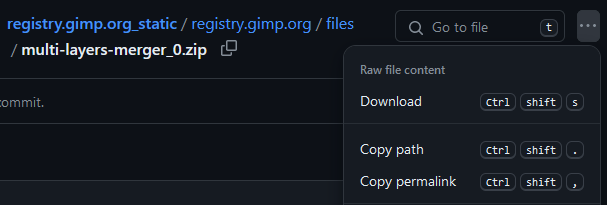
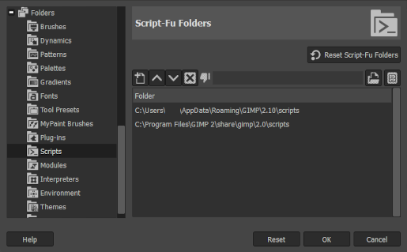
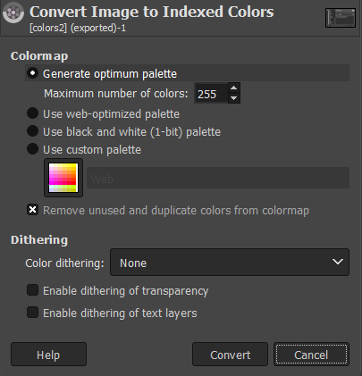
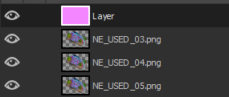
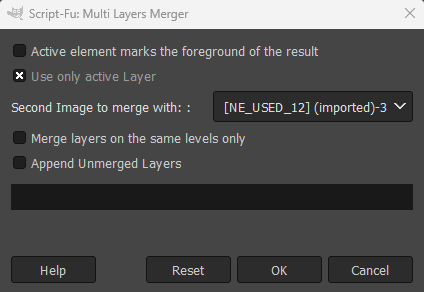
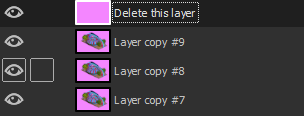
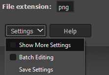
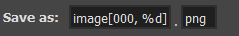
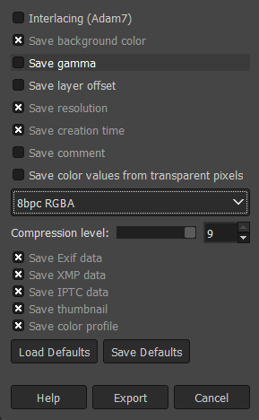

!!! info "Difficulty: Beginner"

# Reducing Colors with GIMP

Zoo Tycoon uses a properietary graphics format that supports up to 255 colors. Typically an 8-bit color palette such as this would support a full spectrum of 256, but the rendering engine the game uses seems to have disregard for the missing color. For this reason, you'll often find that images with more than 255 colors will not display correctly in the game or in tools like Zoot, APE, or ZT Studio.

When we say 'reduce colors', we mean that we're going to take an image with more than 255 colors (which most modern images will have) and reduce it to 255 colors or less. This process is called 'color quantization' and it's a common technique used in image processing.

## Required Tools

- [GIMP](https://www.gimp.org/)
- [Export Layers](https://github.com/kamilburda/gimp-export-layers) *Scroll down to 'Download latest release`*
- (Optional) [Multi-Layers Merger Script](https://github.com/pixlsus/registry.gimp.org_static/blob/master/registry.gimp.org/files/multi-layers-merger_0.zip) *Click on the elipses to the right of the 'Go to file' search bar and select  `Download`.*

    

### Explanation

Though several tools exist to reduce the colors in an image, GIMP is a free and open-source image editor that has a built-in feature to reduce colors so it will be the most-accessible. 

By default, GIMP doesn't have an export feature that can export multiple layers as individual images. The Export Layers plugin is a script that adds this feature to GIMP.

The Multi-Layers Merger script is useful if you have an image with transparency (maybe a set of PNG frames) and need to give every layer a solid color background before reducing the colors. Remember, the game doesn't support the alpha channel in images, so you'll need to remove it for every frame first.

### Installing GIMP Scripts

1. Download the `multi-layers-merger_0.zip` file from the link above.
2. Extract the contents of the zip file to your GIMP scripts directory. You'll need to know the location of your GIMP scripts directory. You can find this by opening GIMP and going to `Edit > Preferences > Folders > Scripts`. The location of your scripts directory will be listed there.

    

## Processing Images

The rest of this guide will assume you have exported your images from Zoo Tycoon and have them ready to process. You'll need to do this from Zoot, APE, or ZT Studio. If you're making your graphics from a 3D modeling program, you'll want to export them as PNG files.

### IDLE (Static) Frames

If you're working with IDLE frames, then this explanation will be brief. 

1. Open the single frame in GIMP

2. Make sure your image has a solid background. Essentially we want to remove the alpha channel from the image. The easiest way to do this is to go to `Layer > Transparency > Remove Alpha Channel`. This will replace the alpha channel with the secondary color in your GIMP color palette. However, this isn't always perfect because intermediate alpha values might not look good once replaced. For this reason, you might try your best at controlling alpha output before starting the color reduction process. If you're using Blender, the composite node editor is the place to do this.

3. Go to `Image > Mode > Indexed...`. You'll be presented with a dialog box where you can set the number of colors to 255. Click `Convert` and that should do it.

    

You might notice that Zoo Tycoon graphics tend to have a posterized look to them because of the limited color palette. You can experiment with the maximum number of colors to degrade the image quality to your liking.  

### USED (Animated) Frames

1. First, you'll need to import all of your frames into a single GIMP project. You can do this by going to `File > Open as Layers...` and selecting all of your frames.

2. As done in the IDLE step, you'll need to make sure each frame does not have an alpha channel. You can go about this by going layer by layer and removing the alpha channel as we did above. That will work but is a bit tedious. Alternatively, you can use the Multi-Layers Merger script to give each layer a solid color background in one go. Note that this assumes that the *only* transparent pixels in your image is the background. If you have alpha artifacts in your image, you'll need to remove them manually. Make sure you've done this before moving on. As mentioned previously, you can automate this using the Blender compositing node editor.

   - First, create a new layer and fill it with the color you want to use as the background. This will be the color that the game will treat as transparent. In reality, it's looking for the top-left pixel color to be transparent, but we'll just make it all one color for simplicity. Make sure this color is not used in your image.

        

    - Make sure the background layer is at the top of the layer stack and that is the active layer. Run the Multi-Layers Merger script by going to `Layer > Multi-Layers Merger`. Deselect all options except `Use only active layer`. Click `OK`.

        

        Every layer should now have a solid background. Note that this leaves behind the layer with the solid background. Don't forget to delete it.

        

3. Now that you have all of your frames with solid backgrounds, you can go to `Image > Mode > Indexed...` and set the number of colors to 255. Click `Convert`. Remember that you can experiment with the number of colors to get the desired effect to get that posterized look most Zoo Tycoon graphics have.

## Exporting Frames

At this point, you should have all of your frames reduced to 255 colors. You can now export them as PNG files. If you have the Export Layers plugin installed, you can go to `File > Export Layers...` and export all of your frames as PNG files. If you don't have the plugin, you'll need to export each frame manually.

By default, each layer will be exported with the same name as the layer. Usually this is fine, but if you need to rename them, you can do so in the `Show More Settings` dialog. 

You can experiment with preferred naming conventions but I find that `image[000, %d]` works the best because the frames are usually imported in reverse order. This expression will name the frames in descending order: `image010`, `image009`, `image008`, etc.

Once you're happy with the names, click `Export` and at this point you will only need to change the pixelformat to `8bpc RGBA`. Click `Export` and you're done!

