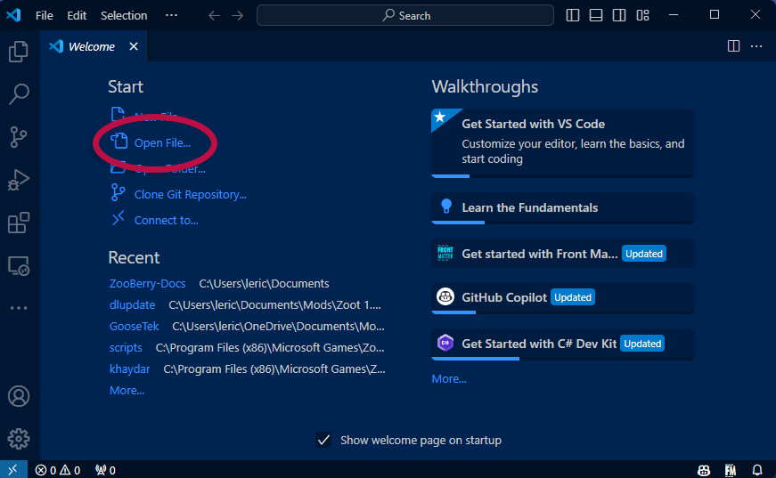
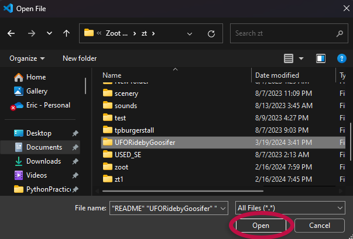
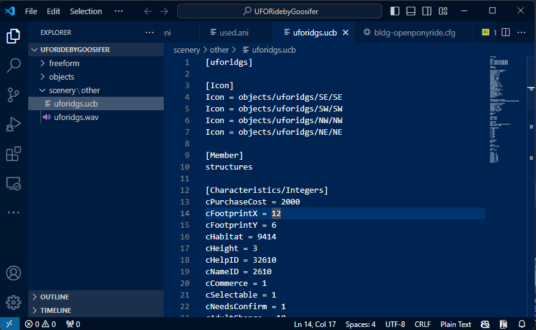
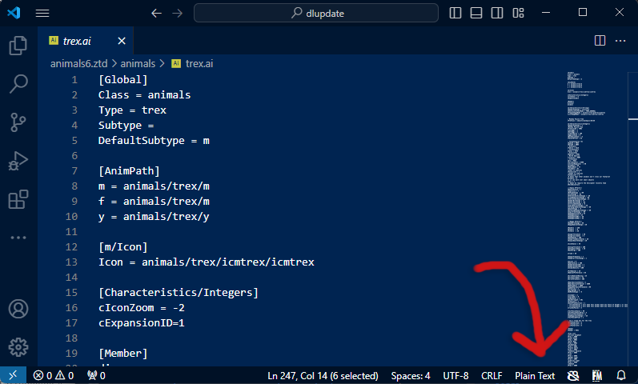
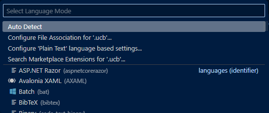
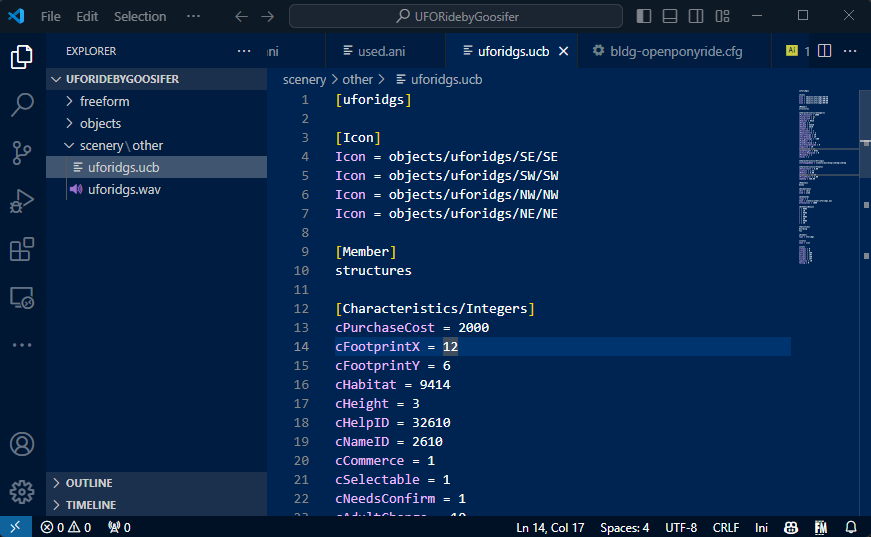

!!! info "Difficulty: Beginner"

# Using Visual Studio Code

Visual Studio Code (VS Code) is a free and open-source code editor developed by Microsoft. Though there are many text editors available for free, VS Code is a popular choice these days because it's highly extensible so it can be used for many different programming languages and file formats.

You can download the latest Visual Studio Code release from its [official website](https://code.visualstudio.com/). Once you have it installed, you can open it and start using it right away.

## The Basics

When you first open VS Code, you'll see a welcome screen with the option to create a new file, open a file, open a folder, and a few other options for more advanced users. VS Code works best when you have a working directory open, so I recommend clicking on the `Open Folder` button and selecting the directory where you'll be working on your Zoo Tycoon 1 mods.

You'll then see a dialog window where you can select the directory you want to open. Once you've selected the directory, click the `Open` button to open it in VS Code.

Once you have your directory open, you'll notice a change in your workspace. On the left you'll see a file explorer that lets you quickly navigate through your project's files without having to leave the editor or open up a new instance. This is a great feature that will help you stay organized and focused on your work.

On the right-hand side of the window, you'll see the editor. You can see your files here and edit them when you click on your files in the file explorer. You can also open multiple files at once and switch between them using the tabs at the top of the editor.

## Setting Up VS Code for Zoo Tycoon 1 Modding

Zoo Tycoon 1 uses a few different file extensions for its configuration files, but they're really just [INI files](https://en.wikipedia.org/wiki/INI_file). INI files are a simple way to store configuration data, and they're easy to read and write. VS Code by default will give us syntax highlighting for INI files, but it won't do this out-of-the-box for the custom INI files that Zoo Tycoon 1 uses. We'll need to do somme quick and easy setup to get this working.

This guide will assume you already know how to access the game's files and have them extracted to a directory on your computer.

1. First, open VS Code and open any file with a `.ai`, `.ucs`, `.ucb`, `.ucs`, or `.lyt` extension. You will need to repeat these steps for each of these file types. For this guide, I have opened the `trex.ai` file from the game's `animals` directory.

2. Once the file is open, you should see the file's contents. In the bottom-right corner of the window, you should see the file's language mode. Click on this language mode to open the language mode picker. By default, it is set to `Plain Text`.

    

3. You'll see a list of programming languages you can choose from. In the search bar, type `INI` and you should see `INI` as the first filtered option. Click on `INI` to set the file's language mode to INI.

    

4. Once you've set the language mode to INI, you should see the file's contents change to reflect the new syntax highlighting. This will make it easier to read and write your configuration files.

    

Repeat the steps above for the other configuration files types mentioned. You should only need to do this once for each file type, and then VS Code will remember your preference for the next time you open a file with the same extension.

## External Resources

For more information on using Visual Studio Code, you can check out the [official documentation](https://code.visualstudio.com/docs).